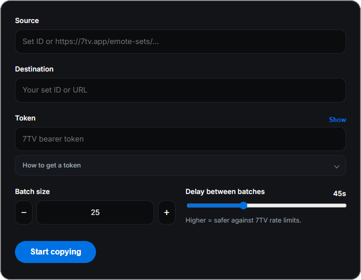

<p align="center">
  
</p>

<h1 align="center">7TV Emote Copier</h1>

<p align="center">
  Copy any <a href="https://7tv.app">7TV</a> emote set.<br>
  Free, open source, and your token never leaves your device.
</p>

<p align="center">
  <a href="https://github.com/TaahDev/7tv-copy-emote-set/releases/latest"></a>
  <a href="LICENSE"></a>
  
</p>

---

<p align="center">
  
</p>

Paste a source set, pick your destination, enter your token, and copy in safe batches.

## Features

- Copy a full emote set from a URL or set ID
- Batched copies with a delay so 7TV rate limits are less likely to trip
- Cancel anytime
- Token stays on your device

## Download

Windows only.

- **Latest version:** [Releases](https://github.com/TaahDev/7tv-copy-emote-set/releases/latest) — `7tv-emote-copier.exe`

Download the `.exe` and run it. There is no installer.

Windows SmartScreen may warn that the publisher is unknown. That is expected: the build is unsigned. Use **More info** → **Run anyway**

## Usage

1. Download and open **7tv-emote-copier.exe**.
2. **Source** — a set ID or URL like `https://7tv.app/emote-sets/…`
3. **Destination** — the set you own (or can edit). Same ID or URL format.
4. **Token** — your 7TV bearer token (see below, or **How to get a token** in the app).
5. **Start copying**.

Default pace is 25 emotes per batch with 45 seconds between batches. Raise the delay if you get rate-limited (HTTP 429).

### Getting your token

1. Sign in at [7tv.app](https://7tv.app).
2. Open DevTools with `F12` or `Ctrl`+`Shift`+`I`, then open the **Network** tab.
3. Browse any emote set so a request named `gql` shows up.
4. Click it → **Headers** → scroll down to **Authorization**, and copy the value after `Bearer`. It always starts with `ey`.
5. Paste that into the app.

It is stored only on this device. It is sent to 7TV, nowhere else.

## How it works

1. `GET https://7tv.io/v3/emote-sets/{source}` → emote list
2. Batched `POST https://7tv.io/v3/gql` with `ChangeEmoteInSet(ADD)` mutations
3. Default 25 per batch + 45s delay to respect 7TV rate limits
4. Per-emote errors surfaced (401/403/429 handled with friendly messages)
5. Cancellable via `AbortController` — no trailing delay after the final batch

All logic: [`src/lib/seventv.ts`](src/lib/seventv.ts). UI: [`src/App.tsx`](src/App.tsx).

## Development

```sh
npm install
npm run dev
```

Then open http://localhost:1420. Production desktop builds need [Tauri’s prerequisites](https://v2.tauri.app/start/prerequisites/) and `npx tauri build`. That produces `src-tauri/target/release/7tv-emote-copier.exe`.

## License

[MIT](LICENSE)
